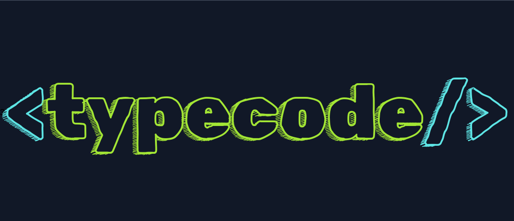
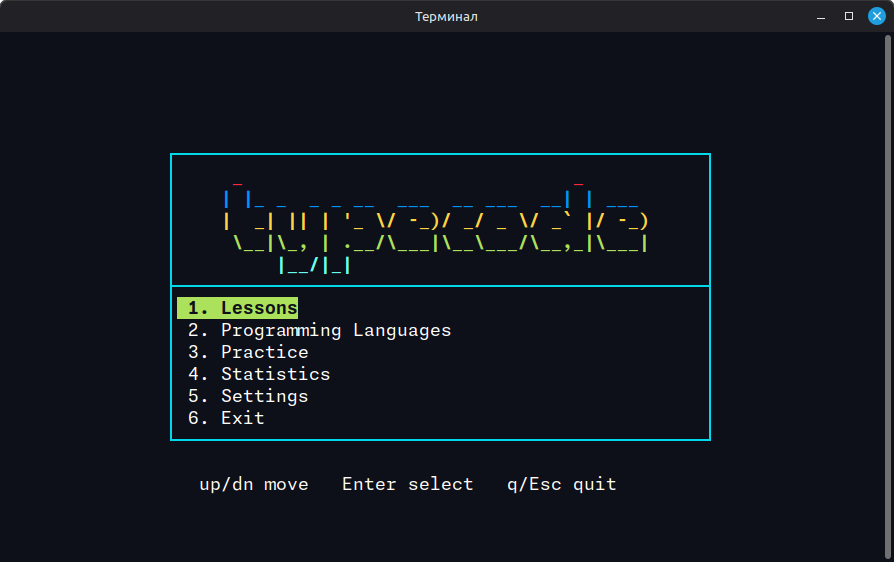
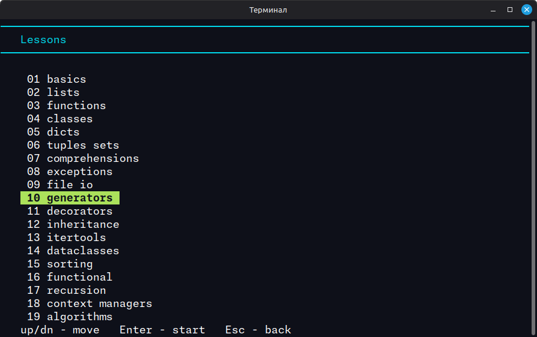
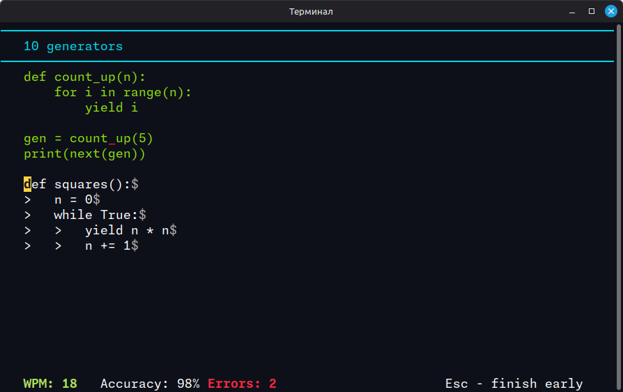
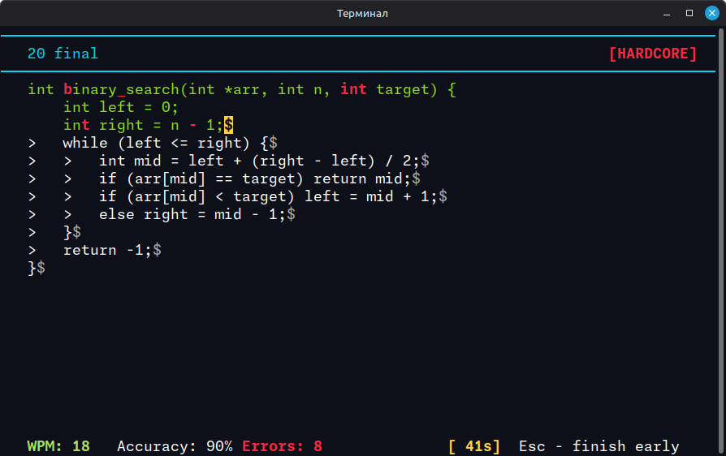
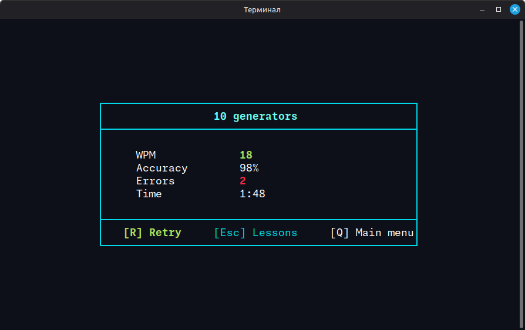
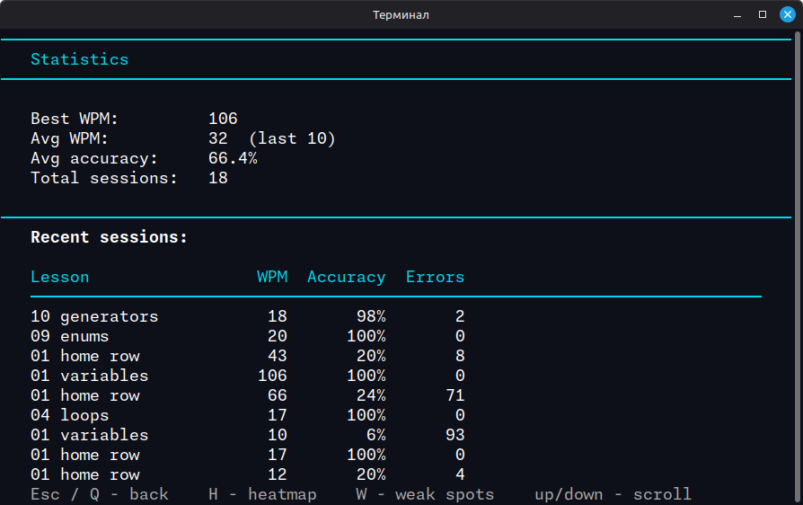
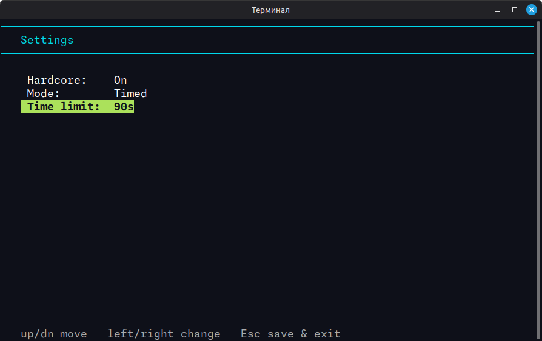
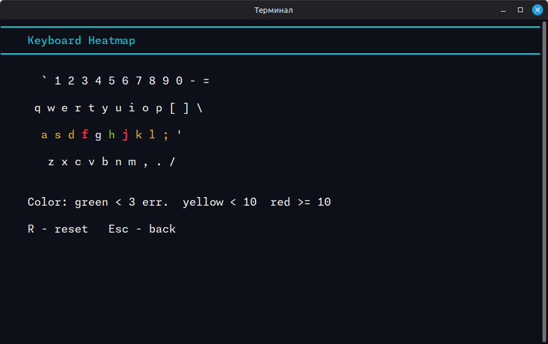
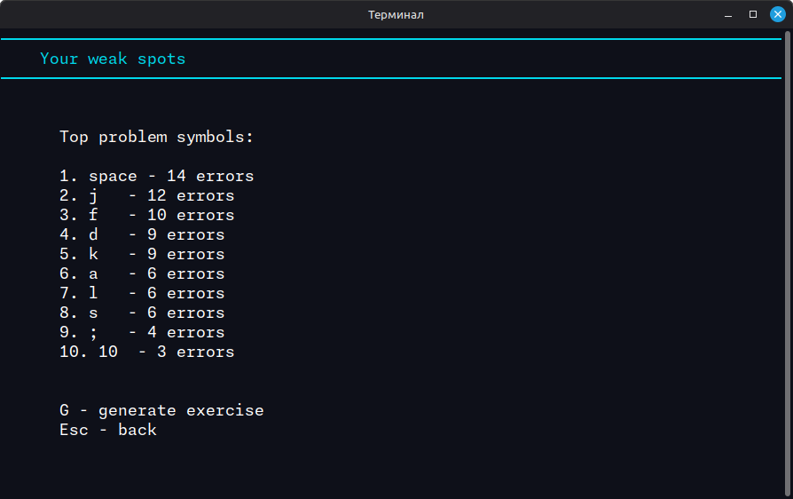

# typecode

<p align="center">
  
</p>

[Русский](README.md) | **English**

> A terminal-based typing trainer for programmers. Built in pure C with ncurses.



---

## Navigation

- [What is typecode?](#what-is-typecode)
- [Features](#features)
- [Interface](#interface)
- [Installation](#installation)
- [Project structure](#project-structure)
- [Makefile targets](#makefile-targets)
- [Keyboard shortcuts](#keyboard-shortcuts)
- [Tech stack](#tech-stack)
- [Contributing](#contributing)

---

## What is typecode?

typecode is a TUI typing trainer designed specifically for programmers. Unlike generic typing tools, typecode trains you on real code - syntax, patterns, and constructs from the languages you actually use every day.

It feels like a real Linux terminal utility, not a toy. Think `btop`, `lazygit`, `htop` - but for improving your typing speed on code.

**What you train:**
- Blind typing (touch typing without looking at the keyboard)
- Fast input of programming syntax
- Muscle memory for language-specific constructs
- Special characters: `{}`, `[]`, `()`, `<>`, `;`, `->`, `=>`, `::`, `&&`, `||`

---

## Features

### MVP
- TUI main menu with keyboard navigation
- Typing engine with real-time feedback (green / red / yellow cursor)
- Live metrics: WPM, accuracy, error count
- Lessons loaded from plain text files
- 5 built-in lessons (home row, top row, bottom row, numbers, symbols)
- Results screen after each session

### v1.0
- 20 progressive lessons
- Programming Languages mode: C, Python, JavaScript, Bash, Go - 20 lessons per language
- Load any custom file from the menu and type it
- Statistics saved between sessions (best WPM, history, accuracy)
- Hardcore mode - no Backspace allowed
- Practice modes: Time Attack (15-300s) and Infinite loop
- Settings screen with persistent config in `~/.typecode/settings.conf`
- Dynamic terminal resize on all screens
- Warning when terminal is smaller than 80x24
- Exit with `q` or `Esc`

### v2.0
- Keyboard heatmap - ASCII QWERTY visualization with color-coded error frequency
- Top-10 weak symbols with auto-generated personal practice exercise
- Heatmap data persists between sessions in `~/.typecode/heatmap.txt`
- 33 tests across 7 test files, `make coverage` with 60% minimum threshold

### v3.0+ (planned)
- Cyrillic / Russian lessons
- Vim mode navigation (`hjkl`)
- Speed Challenge with ranks (S / A / B / C)
- Animated splash screen
- Man page

---

## Interface

### Main menu


### Lessons



20 lessons per language with progressive difficulty.

### Typing session



- **Green** - correct characters
- **Red** - mistakes
- **Yellow** - current cursor position
- Live metrics: WPM, accuracy, errors

### Hardcore + Timed mode



In Hardcore mode Backspace is disabled. In Timed mode a countdown timer is shown.

### Results screen



### Statistics



Full session history with best WPM, average accuracy and recent results. Heatmap (`H`) and Weak Spots (`W`) are accessible directly from this screen.

### Settings



Toggle Hardcore, practice mode (Normal / Timed / Infinite) and time limit. Config is saved to `~/.typecode/settings.conf`.

### Keyboard heatmap



ASCII QWERTY visualization: green - fewer than 3 errors, yellow - fewer than 10, red - 10 or more. Data persists between sessions.

### Weak spots



Top-10 symbols with the most errors. Press `G` to generate a personal practice exercise targeting those symbols.

---

## Installation

### Requirements

| Tool | Purpose | Required for |
|------|---------|--------------|
| GCC | Compiler | `make`, `make test`, `make coverage` |
| libncurses-dev | TUI library | `make`, `make test`, `make coverage` |
| Python 3 + gcovr | Coverage reporting | `make coverage` |

### Install dependencies

```bash
# Ubuntu / Debian
sudo apt install gcc libncurses-dev python3-pip
pip3 install gcovr

# Arch
sudo pacman -S gcc ncurses python-pip
pip3 install gcovr

# Fedora
sudo dnf install gcc ncurses-devel python3-pip
pip3 install gcovr
```

### Build from source

```bash
git clone https://github.com/ginluv21/typecode.git
cd typecode
make
./typecode
```

---

## Project structure

```
typecode/
- src/
  - main.c        # Entry point, Practice load-file, main menu loop
  - ui.c          # ncurses init, resize, color pairs
  - menu.c        # Main menu, navigation
  - lesson.c      # Typing engine, lessons, results screen
  - lessons.c     # Lesson list, language selector
  - stats.c       # Statistics: save, load, screen
  - settings.c    # Settings: save, load, screen
- include/
  - typecode.h    # Shared constants and types
  - ui.h
  - menu.h
  - lesson.h
  - stats.h
  - settings.h
- lessons/
  - latin/        # 20 base typing lessons (home row -> final)
  - c/            # 20 C lessons
  - python/       # 20 Python lessons
  - javascript/   # 20 JavaScript lessons
  - bash/         # 20 Bash lessons
  - go/           # 20 Go lessons
- tests/          # Test suite (33 tests)
- build/          # Build artifacts (gitignored)
- Makefile
- README.md
```

---

## Makefile targets

```bash
make            # Build the project
make run        # Build and run
make debug      # Build with -g -fsanitize=address,undefined
make test       # Run all tests
make coverage   # Run tests + coverage report (min 60%)
make check-deps # Verify all dependencies are installed
make clean      # Remove build artifacts
```

---

## Keyboard shortcuts

| Key | Action |
|-----|--------|
| `up` / `dn` | Navigate menu |
| `1`-`6` | Direct menu selection |
| `Enter` | Confirm |
| `Backspace` | Fix last character |
| `Esc` / `q` | Exit / go back |
| `R` | Retry lesson |
| `Q` | Back to menu |

---

## Tech stack

| | |
|---|---|
| Language | C (C11) |
| TUI | ncurses |
| Build | GCC + Makefile |
| Platform | Linux |
| Dependencies | libncurses, gcovr (for coverage) |

No C++. No heavy frameworks. No unnecessary dependencies.

---

## Contributing

This project is open source and built by students learning C.

1. Fork the repo
2. Create a branch: `git checkout -b feature/your-feature`
3. Commit your changes
4. Open a Pull Request

Check the [Issues](https://github.com/ginluv21/typecode/issues) for tasks labeled `MVP` or `v1.0`.
