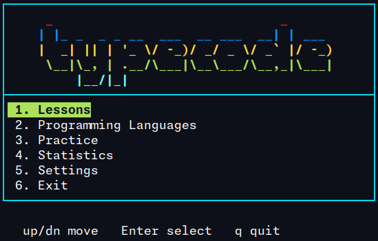

# typecode

**Русский** | [English](README.en.md)

> Тренажёр слепой печати для программистов прямо в терминале. Написан на чистом C с использованием ncurses.



---

## Навигация

- [Что такое typecode?](#что-такое-typecode)
- [Возможности](#возможности)
- [Интерфейс](#интерфейс)
- [Установка](#установка)
- [Структура проекта](#структура-проекта)
- [Цели Makefile](#цели-makefile)
- [Горячие клавиши](#горячие-клавиши)
- [Стек технологий](#стек-технологий)
- [Участие в разработке](#участие-в-разработке)

---

## Что такое typecode?

typecode - это TUI-тренажёр печати, созданный специально для программистов. В отличие от обычных тренажёров, typecode обучает набору настоящего кода - синтаксиса, паттернов и конструкций тех языков, которые ты используешь каждый день.

Ощущается как настоящая Linux-утилита, а не игрушка. Представь `btop`, `lazygit`, `htop` - но для прокачки скорости набора кода.

**Чему ты учишься:**
- Слепая печать (без взгляда на клавиатуру)
- Быстрый набор программного синтаксиса
- Мышечная память на конструкции языков
- Специальные символы: `{}`, `[]`, `()`, `<>`, `;`, `->`, `=>`, `::`, `&&`, `||`

---

## Возможности

### MVP
- TUI главное меню с навигацией клавишами
- Движок печати с мгновенной обратной связью (зелёный / красный / жёлтый курсор)
- Метрики в реальном времени: WPM, точность, количество ошибок
- Уроки загружаются из обычных текстовых файлов
- 5 базовых уроков (домашний ряд, верхний, нижний, цифры, символы)
- Экран результатов после каждой сессии

### v1.0
- 20 уроков с нарастающей сложностью
- Режим Programming Languages: C, Python, JavaScript, Bash, Go
- Загрузка любого файла с диска прямо из меню
- Статистика между сессиями (лучший WPM, история, точность)
- Hardcore режим - Backspace отключён
- Режимы практики: Time Attack (30 / 60 / 120 сек) и бесконечный режим
- Экран настроек с сохранением конфигурации

### v2.0+ (в планах)
- Heatmap клавиатуры - видишь на каких клавишах больше всего ошибок
- Уроки на кириллице / русском языке
- Vim mode навигация (`hjkl`)
- Speed Challenge с рангами (S / A / B / C)
- Анимированный splash screen при запуске
- Man page

---

## Интерфейс

### Главное меню

```
┌────────────────────────────────────────────────┐
│     _                              _           │
│    | |_ _  _ _ __  ___  __ ___  __| | ___      │
│    |  _| || | '_ \/ -_)/ _/ _ \/ _` |/ -_)     │
│     \__|\_, | .__/\___|\__\___/\__,_|\___|     │
│         |__/|_|                                │
├────────────────────────────────────────────────┤
│ 1. Lessons                                     │
│ 2. Programming Languages                       │
│ 3. Practice                                    │
│ 4. Statistics                                  │
│ 5. Settings                                    │
│ 6. Exit                                        │
└────────────────────────────────────────────────┘
```

### Сессия печати

```
┌──────────────────────────────────────────────┐
│ C Language Practice                [NORMAL]  │
├──────────────────────────────────────────────┤

  for (int i = 0; i < n; i++) {
      printf("%d\n", i);
  }

  for (int i = 0; i <
                   ^

├──────────────────────────────────────────────┤
│ WPM: 74   Точность: 97%   Ошибки: 2   0:42  │
└──────────────────────────────────────────────┘
```

- **Зелёный** - правильно введённые символы
- **Красный** - ошибки
- **Жёлтый** - текущая позиция курсора

### Экран результатов

```
┌──────────────────────────────────────────────┐
│               Сессия завершена               │
├──────────────────────────────────────────────┤
│  WPM          74                             │
│  Точность     97%                            │
│  Ошибки       2                              │
│  Время        0:42                           │
├──────────────────────────────────────────────┤
│  [R] Повторить    [Q] Главное меню           │
└──────────────────────────────────────────────┘
```

---

## Установка

### Требования

- Linux
- GCC
- ncurses (`libncurses-dev`)

### Сборка из исходников

```bash
git clone https://github.com/ginluv21/typecode.git
cd typecode
make
./typecode
```

### Установка ncurses (если не установлен)

```bash
# Ubuntu / Debian
sudo apt install libncurses-dev

# Arch
sudo pacman -S ncurses

# Fedora
sudo dnf install ncurses-devel
```

---

## Структура проекта

```
typecode/
├── src/
│   ├── main.c          # Точка входа
│   ├── ui.c / ui.h     # Инициализация ncurses, цвета
│   ├── menu.c / menu.h # Отрисовка и навигация меню
│   ├── typing.c / .h   # Движок печати, цикл ввода
│   ├── stats.c / .h    # Статистика, сохранение сессий
│   └── lessons.c / .h  # Загрузчик уроков, парсер файлов
├── include/            # Общие заголовочные файлы
├── lessons/
│   ├── latin/          # Базовые уроки печати
│   ├── c/              # Сниппеты C
│   ├── python/         # Сниппеты Python
│   ├── javascript/     # Сниппеты JavaScript
│   ├── bash/           # Сниппеты Bash
│   └── go/             # Сниппеты Go
├── data/               # Данные (статистика, конфиг)
├── build/              # Скомпилированные объекты (в .gitignore)
├── Makefile
└── README.md
```

---

## Цели Makefile

```bash
make          # Собрать проект
make run      # Собрать и запустить
make debug    # Сборка с -g -fsanitize=address
make clean    # Удалить артефакты сборки
```

---

## Горячие клавиши

| Клавиша | Действие |
|---------|----------|
| `up` / `dn` | Навигация по меню |
| `1`–`6` | Прямой выбор пункта |
| `Enter` | Подтвердить |
| `Backspace` | Исправить последний символ |
| `Esc` | Выйти из текущей сессии |
| `R` | Повторить урок |
| `Q` | Вернуться в меню |

---

## Стек технологий

| | |
|---|---|
| Язык | C (C11) |
| TUI | ncurses |
| Сборка | GCC + Makefile |
| Платформа | Linux |
| Зависимости | только libncurses |

Без C++. Без тяжёлых фреймворков. Без лишних зависимостей.

---

## Участие в разработке

Проект с открытым исходным кодом, создан студентами, изучающими C.

1. Сделай форк репозитория
2. Создай ветку: `git checkout -b feature/название-фичи`
3. Закоммить изменения
4. Открой Pull Request

Смотри [Issues](https://github.com/ginluv21/typecode/issues) с метками `MVP` или `v1.0`.
